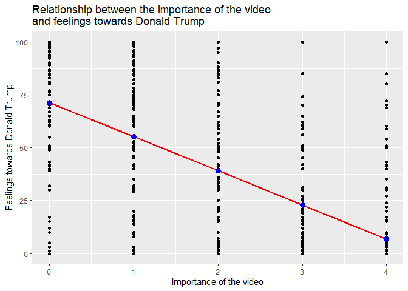

Trump
================
Kejing Li
11/17/2019

  - [Q1](#q1)
  - [Q2](#q2)

``` r
library(tidyverse)
```

    ## -- Attaching packages ---------------------------------------------------------- tidyverse 1.2.1 --

    ## v ggplot2 3.2.1     v purrr   0.3.2
    ## v tibble  2.1.3     v dplyr   0.8.3
    ## v tidyr   1.0.0     v stringr 1.4.0
    ## v readr   1.3.1     v forcats 0.4.0

    ## -- Conflicts ------------------------------------------------------------- tidyverse_conflicts() --
    ## x dplyr::filter() masks stats::filter()
    ## x dplyr::lag()    masks stats::lag()

``` r
library(broom)
library(modelr)
```

    ## 
    ## Attaching package: 'modelr'

    ## The following object is masked from 'package:broom':
    ## 
    ##     bootstrap

``` r
library(coefplot)
```

``` r
#import the data
trump_data <- read_csv("data/trump.csv")
```

    ## Parsed with column specification:
    ## cols(
    ##   trump = col_double(),
    ##   video = col_double(),
    ##   female = col_double(),
    ##   pid = col_double(),
    ##   age = col_double(),
    ##   educ = col_double()
    ## )

# Q1

## Estimate a basic (single variable) linear regression model of the relationship between the importance of the video and feelings towards Donald Trump.

``` r
# estimate ols model using lm()
trump_mod <- lm(trump ~ video, data = trump_data)
tidy(trump_mod)
```

    ## # A tibble: 2 x 5
    ##   term        estimate std.error statistic p.value
    ##   <chr>          <dbl>     <dbl>     <dbl>   <dbl>
    ## 1 (Intercept)     71.2     0.779      91.4       0
    ## 2 video          -16.1     0.295     -54.6       0

## Calculate predicted values

``` r
#uses the model to generate predictions for each observation in the data frame
trump_predict <- augment(trump_mod,
                     newdata = data_grid(trump_data, video))
trump_predict
```

    ## # A tibble: 5 x 3
    ##   video .fitted .se.fit
    ##   <dbl>   <dbl>   <dbl>
    ## 1     0   71.2    0.779
    ## 2     1   55.1    0.562
    ## 3     2   39.0    0.446
    ## 4     3   22.9    0.505
    ## 5     4    6.82   0.697

## Graph the relationship between the two variables using the predicted values, and determine whether there appears to be a significant relationship.

``` r
#plot the predicted value and original data 
ggplot(trump_data, aes(video)) +
  geom_point(aes(y = trump)) +
  geom_line(aes(y = .fitted), data = trump_predict, color = "red", size = 1) +
  geom_point(aes(y = .fitted), data = trump_predict, color = "blue", size = 3)+
  labs(title = "Relationship between the importance of the video \nand feelings towards Donald Trump",
       x = "Importance of the video",
       y = "Feelings towards Donald Trump")
```

<!-- -->

**Answer:** From the above estimation, there appears to be a significant
relationship for two reasons:

1.  The model’s p-value is 0, which indicates significance.
2.  It can be learned from the above graph that the more people care
    about the video, the lower their feeling thermometer ratings of
    trump will be expected.

# Q2

## Estimate a linear regression model of attitudes towards Donald Trump given the variables you have available. You can specify the model in whatever form you choose (e.g. use all variables, add higher-order polynomial terms, convert variables to factors).

``` r
# estimate ols model using all the variables 
trump_mod_all <- lm(trump ~ video + female + pid + age + educ, 
                    data = trump_data)
```

## Present the results of the model as a regression results table (i.e. a tidy, clean looking table presenting the coefficients/standard errors with human-readable labels).

``` r
# extract coefficients using tidy()
trump_mod_all_coef <- tidy(trump_mod_all, 
                           conf.int = TRUE)
trump_mod_all_coef
```

    ## # A tibble: 6 x 7
    ##   term        estimate std.error statistic   p.value conf.low conf.high
    ##   <chr>          <dbl>     <dbl>     <dbl>     <dbl>    <dbl>     <dbl>
    ## 1 (Intercept)   46.4      2.37      19.6   5.46e- 81  41.8       51.0  
    ## 2 video        -10.2      0.316    -32.3   2.05e-198 -10.8       -9.60 
    ## 3 female        -0.611    0.779     -0.784 4.33e-  1  -2.14       0.916
    ## 4 pid            6.68     0.217     30.8   3.98e-183   6.26       7.11 
    ## 5 age            0.134    0.0222     6.05  1.64e-  9   0.0908     0.178
    ## 6 educ          -1.28     0.171     -7.50  8.45e- 14  -1.62      -0.947

## Visualization

``` r
# Use the coefplot package to automatically generate the coefficient plot
coefplot(trump_mod_all,
         sort = "magnitude", 
         intercept = FALSE)
```

<!-- -->

## Provide written analysis interpreting the results.

  - First of all,except for the percentage of female, all the variables
    have p-values smaller than 0.05, indicating significant influences
    on the feeling thermometer ratings of trump.
  - The coefficient value signifies how much the mean of the dependent
    variable changes given a one-unit shift in the independent variable
    while holding other variables in the model constant.
      - In the graph, education level and attitudes towards the video
        have negative coefficient values. That is to say, the more
        highly educated and care about the video an individual is, the
        more negative attitude towards Donald Trump he/she will possibly
        have.
      - On the other hand, the more an individual leaning towards the
        Republican Party and the more older she/he is, the more likely
        he/she will have a positive attitude towards Donald Trump.

<!-- end list -->

``` r
devtools::session_info()
```

    ## - Session info ----------------------------------------------------------
    ##  setting  value                       
    ##  version  R version 3.6.1 (2019-07-05)
    ##  os       Windows 10 x64              
    ##  system   x86_64, mingw32             
    ##  ui       RTerm                       
    ##  language (EN)                        
    ##  collate  English_United States.1252  
    ##  ctype    English_United States.1252  
    ##  tz       America/Chicago             
    ##  date     2019-11-17                  
    ## 
    ## - Packages --------------------------------------------------------------
    ##  package     * version date       lib source        
    ##  assertthat    0.2.1   2019-03-21 [1] CRAN (R 3.6.1)
    ##  backports     1.1.5   2019-10-02 [1] CRAN (R 3.6.1)
    ##  broom       * 0.5.2   2019-04-07 [1] CRAN (R 3.6.1)
    ##  callr         3.3.2   2019-09-22 [1] CRAN (R 3.6.1)
    ##  cellranger    1.1.0   2016-07-27 [1] CRAN (R 3.6.1)
    ##  cli           1.1.0   2019-03-19 [1] CRAN (R 3.6.1)
    ##  coefplot    * 1.2.6   2018-02-07 [1] CRAN (R 3.6.1)
    ##  colorspace    1.4-1   2019-03-18 [1] CRAN (R 3.6.1)
    ##  crayon        1.3.4   2017-09-16 [1] CRAN (R 3.6.1)
    ##  desc          1.2.0   2018-05-01 [1] CRAN (R 3.6.1)
    ##  devtools      2.2.1   2019-09-24 [1] CRAN (R 3.6.1)
    ##  digest        0.6.22  2019-10-21 [1] CRAN (R 3.6.1)
    ##  dplyr       * 0.8.3   2019-07-04 [1] CRAN (R 3.6.1)
    ##  ellipsis      0.3.0   2019-09-20 [1] CRAN (R 3.6.1)
    ##  evaluate      0.14    2019-05-28 [1] CRAN (R 3.6.1)
    ##  fansi         0.4.0   2018-10-05 [1] CRAN (R 3.6.1)
    ##  forcats     * 0.4.0   2019-02-17 [1] CRAN (R 3.6.1)
    ##  fs            1.3.1   2019-05-06 [1] CRAN (R 3.6.1)
    ##  generics      0.0.2   2018-11-29 [1] CRAN (R 3.6.1)
    ##  ggplot2     * 3.2.1   2019-08-10 [1] CRAN (R 3.6.1)
    ##  glue          1.3.1   2019-03-12 [1] CRAN (R 3.6.1)
    ##  gtable        0.3.0   2019-03-25 [1] CRAN (R 3.6.1)
    ##  haven         2.1.1   2019-07-04 [1] CRAN (R 3.6.1)
    ##  hms           0.5.1   2019-08-23 [1] CRAN (R 3.6.1)
    ##  htmltools     0.3.6   2017-04-28 [1] CRAN (R 3.6.1)
    ##  httr          1.4.1   2019-08-05 [1] CRAN (R 3.6.1)
    ##  jsonlite      1.6     2018-12-07 [1] CRAN (R 3.6.1)
    ##  knitr         1.25    2019-09-18 [1] CRAN (R 3.6.1)
    ##  labeling      0.3     2014-08-23 [1] CRAN (R 3.6.0)
    ##  lattice       0.20-38 2018-11-04 [1] CRAN (R 3.6.1)
    ##  lazyeval      0.2.2   2019-03-15 [1] CRAN (R 3.6.1)
    ##  lifecycle     0.1.0   2019-08-01 [1] CRAN (R 3.6.1)
    ##  lubridate     1.7.4   2018-04-11 [1] CRAN (R 3.6.1)
    ##  magrittr      1.5     2014-11-22 [1] CRAN (R 3.6.1)
    ##  memoise       1.1.0   2017-04-21 [1] CRAN (R 3.6.1)
    ##  modelr      * 0.1.5   2019-08-08 [1] CRAN (R 3.6.1)
    ##  munsell       0.5.0   2018-06-12 [1] CRAN (R 3.6.1)
    ##  nlme          3.1-140 2019-05-12 [1] CRAN (R 3.6.1)
    ##  pillar        1.4.2   2019-06-29 [1] CRAN (R 3.6.1)
    ##  pkgbuild      1.0.5   2019-08-26 [1] CRAN (R 3.6.1)
    ##  pkgconfig     2.0.3   2019-09-22 [1] CRAN (R 3.6.1)
    ##  pkgload       1.0.2   2018-10-29 [1] CRAN (R 3.6.1)
    ##  plyr          1.8.4   2016-06-08 [1] CRAN (R 3.6.1)
    ##  prettyunits   1.0.2   2015-07-13 [1] CRAN (R 3.6.1)
    ##  processx      3.4.1   2019-07-18 [1] CRAN (R 3.6.1)
    ##  ps            1.3.0   2018-12-21 [1] CRAN (R 3.6.1)
    ##  purrr       * 0.3.2   2019-03-15 [1] CRAN (R 3.6.1)
    ##  R6            2.4.0   2019-02-14 [1] CRAN (R 3.6.1)
    ##  Rcpp          1.0.2   2019-07-25 [1] CRAN (R 3.6.1)
    ##  readr       * 1.3.1   2018-12-21 [1] CRAN (R 3.6.1)
    ##  readxl        1.3.1   2019-03-13 [1] CRAN (R 3.6.1)
    ##  remotes       2.1.0   2019-06-24 [1] CRAN (R 3.6.1)
    ##  reshape2      1.4.3   2017-12-11 [1] CRAN (R 3.6.1)
    ##  rlang         0.4.0   2019-06-25 [1] CRAN (R 3.6.1)
    ##  rmarkdown     1.16    2019-10-01 [1] CRAN (R 3.6.1)
    ##  rprojroot     1.3-2   2018-01-03 [1] CRAN (R 3.6.1)
    ##  rstudioapi    0.10    2019-03-19 [1] CRAN (R 3.6.1)
    ##  rvest         0.3.4   2019-05-15 [1] CRAN (R 3.6.1)
    ##  scales        1.0.0   2018-08-09 [1] CRAN (R 3.6.1)
    ##  sessioninfo   1.1.1   2018-11-05 [1] CRAN (R 3.6.1)
    ##  stringi       1.4.3   2019-03-12 [1] CRAN (R 3.6.0)
    ##  stringr     * 1.4.0   2019-02-10 [1] CRAN (R 3.6.1)
    ##  testthat      2.2.1   2019-07-25 [1] CRAN (R 3.6.1)
    ##  tibble      * 2.1.3   2019-06-06 [1] CRAN (R 3.6.1)
    ##  tidyr       * 1.0.0   2019-09-11 [1] CRAN (R 3.6.1)
    ##  tidyselect    0.2.5   2018-10-11 [1] CRAN (R 3.6.1)
    ##  tidyverse   * 1.2.1   2017-11-14 [1] CRAN (R 3.6.1)
    ##  useful        1.2.6   2018-10-08 [1] CRAN (R 3.6.1)
    ##  usethis       1.5.1   2019-07-04 [1] CRAN (R 3.6.1)
    ##  utf8          1.1.4   2018-05-24 [1] CRAN (R 3.6.1)
    ##  vctrs         0.2.0   2019-07-05 [1] CRAN (R 3.6.1)
    ##  withr         2.1.2   2018-03-15 [1] CRAN (R 3.6.1)
    ##  xfun          0.10    2019-10-01 [1] CRAN (R 3.6.1)
    ##  xml2          1.2.2   2019-08-09 [1] CRAN (R 3.6.1)
    ##  yaml          2.2.0   2018-07-25 [1] CRAN (R 3.6.0)
    ##  zeallot       0.1.0   2018-01-28 [1] CRAN (R 3.6.1)
    ## 
    ## [1] D:/Tools/R-3.6.1/library
